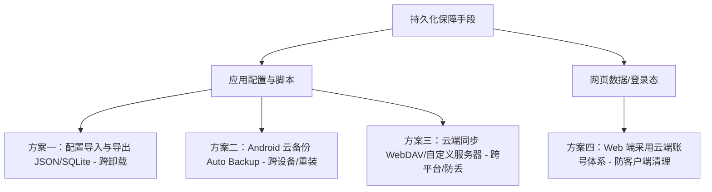

# NetNest 永久/超强持久化方案设计

在移动应用和 Web 应用中，**“绝对永久”**的本地存储是不存在的，因为任何本地数据都会受到以下因素的威胁：
1. 用户卸载应用（系统会自动删除应用私有目录下的所有数据，包括 Room 数据库和 WebView 存储）。
2. 用户在系统设置中手动点击“清除数据”（Clear Data）。
3. 用户更换手机/设备。
4. 手机存储空间极度不足时，系统对缓存的激进清理。

为了在 NetNest 中实现**生存率最高、甚至跨设备、跨卸载的“永久持久化”**，可以采取以下四种主流的优化和改造方案：

---



---

## 方案一：本地导入与导出（Survives Clear Data & Uninstall）

### 💡 核心思路
将应用内的数据（PWA 列表、自定义油猴脚本、甚至脚本的 KV 存储）序列化为 JSON 格式或打包 SQLite 数据库文件，通过 Android **存储访问框架 (Storage Access Framework, SAF)** 导出到手机的**公共目录**（如 `Downloads/` 或 `Documents/`）。
* **优势**：由于数据存储在外部公共目录，即使应用被卸载或清除了数据，备份文件依然存在。
* **做法**：
  1. 在设置页面提供“导出备份”和“恢复备份”按钮。
  2. 使用 Kotlin Serialization 将 `PwaEntity` 和 `UserScriptEntity` 列表导出为 `netnest_backup.json`。
  3. 恢复时让用户手动选择该文件，重新解析并插入到本地 SQLite 中。

---

## 方案二：Android 系统云备份（Survives Device Migration & Reinstall）

### 💡 核心思路
利用 Android 系统的 **Auto Backup (自动备份)** 机制。当用户在手机中开启了 Google 账号/厂商云服务的备份功能，且手机连接 Wi-Fi 并处于空闲充电状态时，系统会自动将应用的私有数据备份至云端（如 Google Drive）。
* **优势**：用户更换新手机或重装应用后，登录相同的账号，数据会自动恢复。
* **实现步骤**：
  1. 在 `AndroidManifest.xml` 中确保开启备份：
     ```xml
     <application
         android:allowBackup="true"
         android:fullBackupContent="@xml/backup_rules"
         android:dataExtractionRules="@xml/data_extraction_rules">
     ```
  2. 在 `res/xml/backup_rules.xml` 中指定只备份 Room 数据库，忽略体积庞大的 WebView 缓存：
     ```xml
     <?xml version="1.0" encoding="utf-8"?>
     <full-backup-content>
         <!-- 备份 Room 数据库文件 -->
         <include domain="database" path="pwa_shell_database" />
         <!-- 排除无意义的 WebView 缓存目录以防超出 25MB 限制 -->
         <exclude domain="root" path="app_webview" />
     </full-backup-content>
     ```

---

## 方案三：云端双向同步（Survives Everything）

### 💡 核心思路
支持第三方云存储协议（如 **WebDAV**，国内可使用坚果云，国外可使用 Nextcloud）或提供自建账户服务。
* **优势**：真正的跨平台、跨设备、防丢失。
* **实现方式**：
  * 在 NetNest 中增加云同步设置，用户输入 WebDAV 服务器地址、账号和应用密码。
  * 每次添加、修改 PWA，或编辑脚本时，将更新后的 JSON 配置文件加密后静默同步上传至 WebDAV 云盘。
  * 启动应用时检测云端文件的修改时间，自动执行双向合并（Merge）。

---

## 方案四：对于网页级数据（如登录态、草稿）的持久化设计

由于 WebView 的底层数据完全受控于 Chromium 内核，如果用户在系统设置里“清除数据”，网页本地的数据（LocalStorage、Cookies 等）**必定会被抹去**。
要让网页数据也做到“永久”，需要从 Web 端的架构设计入手：

| 数据存储位置 | 丢失风险 | 永久方案 |
| :--- | :--- | :--- |
| **客户端 LocalStorage / IndexedDB** | ⚠️ 高（易受系统清理/清除数据影响） | **仅用作临时缓存**。不应把关键的、不可恢复的数据（如未提交的草稿、本地配置）唯一性地存在客户端。 |
| **云端数据库 (MySQL/PostgreSQL)** |  非常低（除非云服务商宕机） | **云端账号体系**。Web 应用应通过 JWT / Session-Cookie 将用户标识与云端数据库绑定，用户的关键状态全部落盘在服务器上。 |

> [!IMPORTANT]  
> **面向 PWA 开发者的最佳实践**：
> 如果您自己是 PWA 的开发者，确保您的网页应用在检测到网络连接时，主动将本地 LocalStorage/IndexedDB 中的离线修改同步到您的服务器上，而客户端本地只充当离线工作台（Offline Sandbox）。

---

## 🛠️ NetNest 改造建议路径

如果您希望立刻在 NetNest 中落地持久化保障，推荐的演进路径如下：

1. **第一阶段 (低成本/高成效)**：在 `AndroidManifest.xml` 中规范配置 `android:allowBackup="true"`，并过滤掉 `app_webview`（以防备份包超出 Android系统限制的 25MB），让用户能够无缝通过 Google/小米/华为云备份恢复 PWA 列表及配置。
2. **第二阶段 (防灾备份)**：在设置页面添加 `导出配置` 与 `导入配置` 按钮，通过 JSON 序列化读写外部公共目录，实现彻底的本地备份方案。
